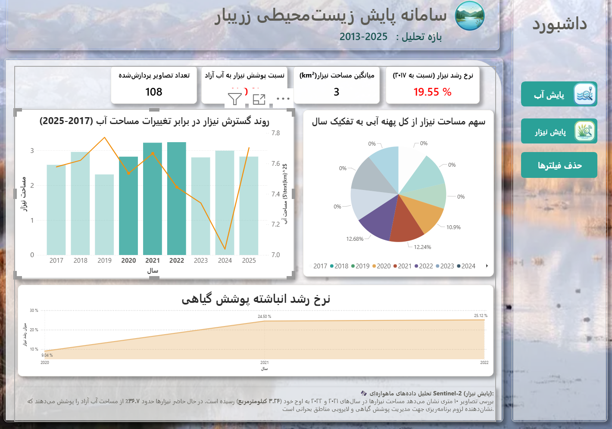
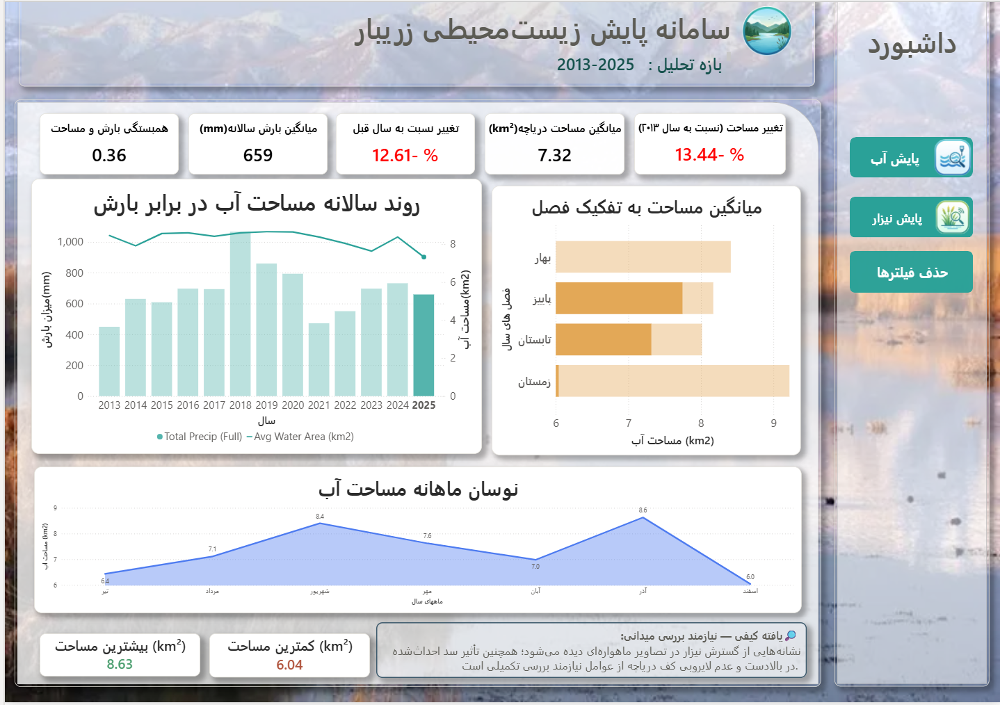

# 🛰️ سامانه پایش زیست‌محیطی و هوش تجاری دریاچه زریبار مریوان

### Zaribar Lake Environmental Monitoring & BI System (2013–2025)

[](https://powerbi.microsoft.com/)
[](https://copernicus.eu/)
[](https://earthexplorer.usgs.gov/)
[](https://docs.microsoft.com/en-us/dax/)
[](https://opensource.org/licenses/MIT)

---

## 📌 درباره پروژه (Project Overview)

این پروژه یک سامانه هوش تجاری (BI) و پایش زیست‌محیطی مبتنی بر سنجش از دور برای **دریاچه زریبار مریوان** است. هدف اصلی سامانه، تحلیل هم‌بستگی میان نوسانات پهنه آبی، تغییرات اقلیمی (بارش CHIRPS) و روند گسترش پوشش گیاهی (نیزارها) در بازه زمانی **۲۰۱۳ تا ۲۰۲۵** بر پایه پردازش ترکیبی تصاویر ماهواره‌ای **Landsat 8 OLI** (تحلیل‌های تاریخی) و **Sentinel-2 MSI** (پایش‌های دقیق ۱۰ متری) است.

رابط کاربری داشبورد با استایل مدرن **Glassmorphism** و معماری **Dynamic Bookmark-driven Tabs** پیاده‌سازی شده است تا سوییچ بین دو لایه تخصصی «پایش آب» و «پایش نیزار» به‌صورت کاملاً تعاملی صورت پذیرد.

---

## 📸 پیش‌نمایش داشبورد (Dashboard Preview)

| نمای پایش نیزار (Reed Dynamics View) | نمای پایش آب (Water Surface View) |
| :---: | :---: |
|  |  |

---

## 📊 شاخص‌های کلیدی عملکرد (KPIs)

| شاخص | مقدار |
| :--- | :---: |
| میانگین مساحت پهنه آبی | ۸٫۲۵ کیلومتر مربع |
| میانگین مساحت نیزار | ۳٫۰۰ کیلومتر مربع |
| نسبت پوشش نیزار به آب آزاد | ۳۸٫۱٪ |
| نرخ رشد انباشته نیزار (نسبت به پایه ۲۰۱۳) | ‎+۱۰٫۵۹٪ |

---

## 🏗️ معماری داده و مدل ستاره‌ای (Data Architecture & Star Schema)

برای دستیابی به حداکثر سرعت پردازش و جلوگیری از ابهام در روابط داده‌ای (Ambiguity)، مدل داده بر اساس **Star Schema** پیاده‌سازی شده است:

```text
                  ┌──────────────────────┐
                  │       Dim_Date       │
                  │ ──────────────────── │
                  │ PK: DateKey / Date   │
                  │     G_Year           │
                  │     G_MonthNo        │
                  └──────────┬───────────┘
                             │
            ┌────────────────┼────────────────┐
            │ 1:*            │ 1:*            │ 1:*
            ▼                ▼                ▼
┌───────────────────┐ ┌───────────────┐ ┌─────────────────────┐
│ zaribar_combined  │ │zaribar_reed_v2│ │zaribar_precip_full  │
│ ───────────────── │ │───────────────│ │──────────────────── │
│ FK: date          │ │FK: ReedDate   │ │FK: date             │
│   water_area_km2  │ │  reed_area_km2│ │  precip_mm          │
│   precip_mm       │ │  n_images     │ └─────────────────────┘
└───────────────────┘ └───────────────┘
```

---

## 📐 شاخص‌های سنجش از دور (Remote Sensing Methodology)

پردازش باندهای طیفی ماهواره‌های Landsat 8 و Sentinel-2 جهت استخراج داده‌ها به شرح زیر بوده است:

**آشکارسازی پهنه آبی (NDWI):**

$$\text{NDWI} = \frac{\text{Green (B3)} - \text{NIR (B8)}}{\text{Green (B3)} + \text{NIR (B8)}}$$

**ارزیابی بیوماس و تراکم نیزار (NDVI):**

$$\text{NDVI} = \frac{\text{NIR (B8)} - \text{Red (B4)}}{\text{NIR (B8)} + \text{Red (B4)}}$$

---

## 🧮 فرمول‌های کلیدی DAX (Key DAX Measures)

```dax
// ۱. میانگین مساحت نیزار
Avg Reed Area =
CALCULATE(
    AVERAGE('zaribar_reed_v2'[reed_area_km2])
)

// ۲. نرخ رشد نیزار نسبت به سال پایه (۲۰۱۳)
Reed Growth % =
VAR BaseReed = CALCULATE(AVERAGE('zaribar_reed_v2'[reed_area_km2]), 'Dim_Date'[G_Year] = 2013)
VAR CurrentReed = AVERAGE('zaribar_reed_v2'[reed_area_km2])
RETURN
DIVIDE(CurrentReed - BaseReed, BaseReed, 0)

// ۳. نسبت مساحت نیزار به آب آزاد
Reed to Water Ratio =
VAR AvgReed = AVERAGE('zaribar_reed_v2'[reed_area_km2])
VAR AvgWater = AVERAGE('zaribar_combined'[water_area_km2])
RETURN
DIVIDE(AvgReed, AvgWater, 0)
```

---

## 🔍 یافته‌های زیست‌محیطی (Key Ecological Insights)

**پایداری بیوماس در برابر نوسان هیدرولوژیکی:** مساحت آب آزاد دریاچه نوسانات سریعی نسبت به بارندگی نشان می‌دهد (مثلاً افت سال ۲۰۲۴)، اما مساحت نیزار به دلیل ساختار ریشه‌ای عمیق و ثبات بیوماس خشک‌شده، در محدوده ۲٫۸ تا ۳٫۲۴ کیلومتر مربع باثبات مانده است.

**پدیده یوتریفیکاسیون (Eutrophication):** اشغال ۳۸٫۱٪ از پهنه آبی توسط نیزارها نشان‌دهنده لزوم کنترل ورودی فاضلاب‌های کشاورزی و اجرای برنامه‌های لایروبی مکان‌مند در بخش‌های جنوبی دریاچه است.

**تحلیل زمان‌مند سری زمانی:** تلفیق داده‌های تاریخی ماهواره Landsat 8 (از سال ۲۰۱۳) و تصاویر با دقت بالای Sentinel-2 (از سال ۲۰۱۵) امکان پایش ۱۲ ساله روند تغییرات پوشش گیاهی و پهنه آبی را بدون گسستگی داده فراهم کرده است.

---

## 🛠️ ساختار ریپازیتوری (Repository Structure)

```text
├── dashboards/
│   └── Zaribar_BI_Dashboard.pbix         # فایل اصلی Power BI
├── data/
│   ├── zaribar_combined.csv              # داده‌های ترکیبی آب و بارش
│   ├── zaribar_reed_v2.csv               # داده‌های سنجش از دور نیزار
│   └── Dim_Date.csv                      # جدول ابعادی تاریخ
├── docs/
│   ├── Zaribar_Environmental_Report.pdf  # گزارش جامع مدیریتی (PDF)
│   └── Zaribar_Environmental_Report.docx # فایل ورد گزارش
├── assets/                               # تصاویر و پیش‌نمایش‌ها
├── LICENSE
└── README.md
```

---

## 📄 مجوز (License)

این پروژه تحت مجوز [MIT License](https://opensource.org/licenses/MIT) منتشر شده است. استفاده از محتوا و الگوها با ذکر نام طراح و مرجع پروژه بلامانع است.

---

**توسعه‌دهنده:** ژیوان محمودی (Jiwan Mahmody) — طراح و تحلیل‌گر داده‌های مکانی و هوش تجاری

**ارتباط:** [پروفایل لینکدین](https://www.linkedin.com/in/jiwan-mahmody-ba9a42337/)
